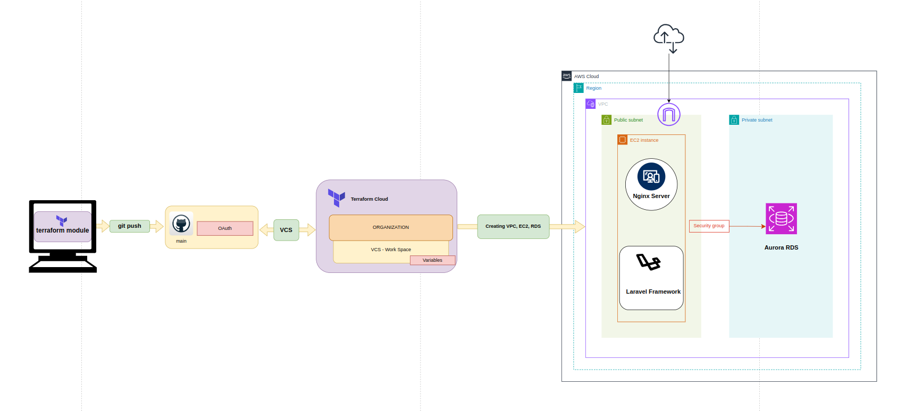
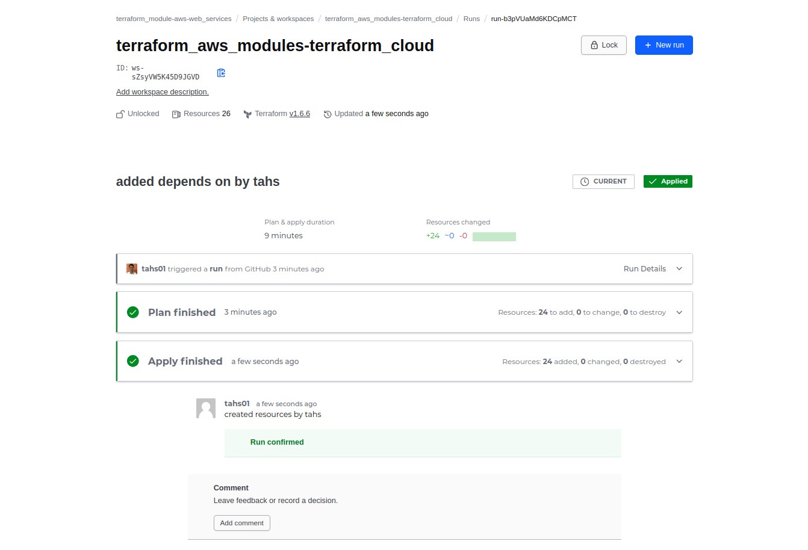
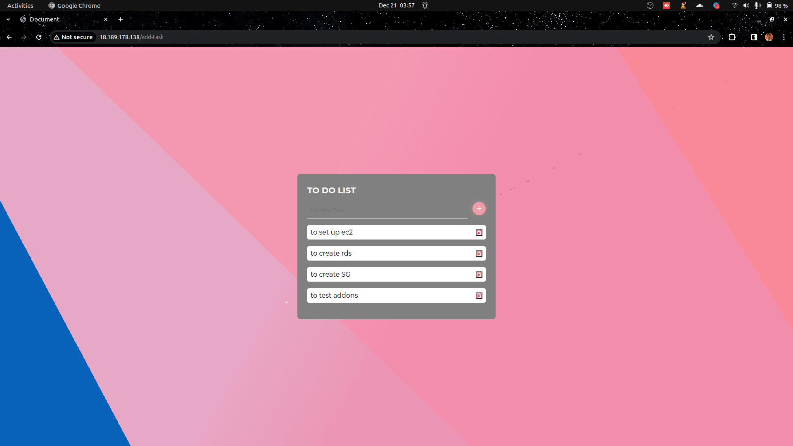
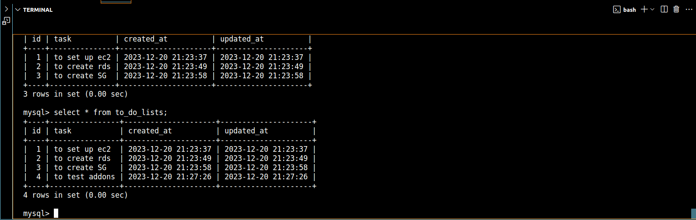

# Mini-project 06 (Terraform Cloud and AWS)

Created by: Than Htike Soe

<aside>
💡 In this scenerio, I used the Terraform module to establish the VPC, abd to create the EC2 instance and Aurora RDS. In addition, I use bash scripts to install Laravel and Ngnix. And I use a security group to grant access to RDS from a single EC2 server. I assigned elastic IP to the EC2 instance so that anyone may reach it from the public.

</aside>

### Git Repo

[GitHub - tahs01/terraform_aws_modules-terraform_cloud](https://github.com/tahs01/terraform_aws_modules-terraform_cloud.git)

### 1. **Create VPC,EC2 and RDS using Terraform Module**

- **Use Terraform to  provision a Virtual Private Cloud (VPC) and necessary networking components, deploy an EC2 instance for handling HTTP requests, and create an Amazon Aurora RDS instance with MySQL compatibility.**

### 2. Configure Nginx, Laravel and Aurora RDS(MySQL)

- **Configure and install the Nginx web server on the EC2 instance to handle HTTP requests.**
- **Set up a Laravel project on the EC2 instance, following best practices for security and performance.**
- ****************Create security group to get access from EC2 instance only.****************
- **Establish a connection between the Laravel application and the Aurora RDS database, ensuring proper credentials and security measures are implemented.**

### 3. **Edit Framework with PHP Code as Todo List App**

- **Modify the Laravel framework to implement a Todo List application using PHP code. Incorporate features such as task creation, updating, deletion, and any additional functionalities deemed appropriate.**

************************Source Codes************************

[GitHub - pphein/todo-test](https://github.com/pphein/todo-test.git)

## the result is as per below

